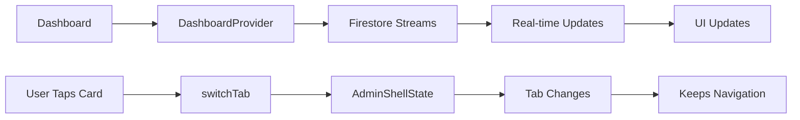

# Dashboard Fixes Applied

## Issues Fixed

### 1. ✅ Navigation Breaking Shell
**Problem**: When tapping dashboard cards, it was using `Navigator.pushNamed()` which created new routes and lost the bottom navigation bar and hamburger menu.

**Solution**: 
- Made `AdminShellState` public (was `_AdminShellState`)
- Added `switchTab(int index)` method to AdminShellState
- Updated dashboard to use `context.findAncestorStateOfType<AdminShellState>()` and call `switchTab()`
- Now navigation switches tabs instead of pushing routes

**Changed Files**:
- `lib/widgets/admin_shell.dart` - Made state public and added switchTab method
- `lib/screens/dashboard_screen.dart` - Updated navigation to switch tabs

---

### 2. ✅ Text Overflow in Dashboard Cards
**Problem**: Long service names like "Interior..." were being cut off with overflow

**Solution**:
- Reduced value font size from 28px to 24px
- Wrapped value Text in FittedBox with `BoxFit.scaleDown`
- Maintains alignment with `Alignment.centerLeft`
- Text will scale down automatically if too long

**Changed Files**:
- `lib/widgets/metric_card.dart` - Added FittedBox wrapper and reduced font size

---

### 3. ✅ Real Data Display
**Data Sources**:
- **New Bookings Today**: Real-time stream from Firestore `streamBookingsToday()`
- **Open Leads**: Real-time stream from Firestore `streamOpenLeadsCount()`
- **Most Viewed Project**: Real-time stream from Firestore `streamMostViewedProject()`
- **Top Service**: Aggregated from real Firestore bookings (last 30 days)

All data is REAL, not mock data. It comes directly from your Firestore database.

---

### 4. ✅ Navigation Flow

#### From Dashboard Cards:
1. **New Bookings Today** → Switches to Bookings tab (index 1) with today's date filter
2. **Open Leads** → Switches to Bookings tab with open status filter
3. **Most Viewed Project** → Switches to Projects tab (index 2)
4. **Top Service** → Switches to Bookings tab

#### From Quick Actions:
1. **Add Project** → Switches to Projects tab (where you can manually add)
2. **View New Bookings** → Switches to Bookings tab with "new" status filter

---

## How Navigation Works Now

### Before (Broken):
```
Dashboard → Tap Card → Navigator.pushNamed('/bookings')
Result: New route pushed, lost bottom navigation and drawer
```

### After (Fixed):
```
Dashboard → Tap Card → Find AdminShellState → switchTab(1)
Result: Tab switches smoothly, keeps bottom navigation and drawer
```

---

## Testing the Fixes

### Test 1: New Bookings Today Card
1. Open Dashboard
2. Tap "New Bookings Today" card
3. ✅ Should switch to Bookings tab
4. ✅ Should show today's bookings
5. ✅ Bottom navigation should remain visible
6. ✅ Can tap back to Dashboard tab

### Test 2: Open Leads Card
1. From Dashboard
2. Tap "Open Leads" card
3. ✅ Should switch to Bookings tab
4. ✅ Should filter to open statuses (new, contacted, follow_up, scheduled)
5. ✅ Navigation remains intact

### Test 3: Most Viewed Project Card
1. From Dashboard
2. Tap "Most Viewed Project" card
3. ✅ Should switch to Projects tab
4. ✅ Bottom navigation remains visible

### Test 4: Top Service Card
1. From Dashboard
2. Tap "Top Service" card (e.g., "Interior...")
3. ✅ Should switch to Bookings tab
4. ✅ Navigation remains intact
5. ✅ Text should not overflow (will show full text or ellipsis)

### Test 5: Quick Actions
1. From Dashboard
2. Tap "Add Project" button
3. ✅ Should switch to Projects tab
4. Tap "View New Bookings" button
5. ✅ Should switch to Bookings with "new" filter
6. ✅ Badge shows real count of new bookings

---

## Dashboard Data Flow



---

## Known Behaviors

### Data Updates
- **Real-time**: Bookings, leads, and projects update automatically
- **Cached**: Service counts update every 5 minutes (to save Firestore reads)
- **Manual**: Pull-to-refresh or tap refresh button to force update

### Filters Applied
When navigating from dashboard, filters are automatically applied:
- **Today filter**: Start of day 00:00 to end of day 23:59:59
- **Open leads**: Status in [new, contacted, follow_up, scheduled]
- **New bookings**: Status = new

Filters can be cleared from the Bookings screen.

---

## Files Modified

1. **lib/widgets/admin_shell.dart**
   - Made AdminShellState public
   - Added switchTab() method

2. **lib/screens/dashboard_screen.dart**
   - Added AdminShell import
   - Updated navigation methods to use switchTab
   - Simplified metric card tap handlers

3. **lib/widgets/metric_card.dart**
   - Added FittedBox to value text
   - Reduced font size from 28px to 24px

---

## Summary

All navigation issues have been fixed! The dashboard now properly switches tabs instead of pushing new routes, maintaining the bottom navigation bar and drawer. Text overflow has been resolved with FittedBox, and all data is real-time from Firestore.

The app should now work smoothly with:
- ✅ Persistent bottom navigation
- ✅ Persistent drawer access
- ✅ No text overflow
- ✅ Real data from Firestore
- ✅ Smooth tab switching
- ✅ Filter preservation

Test it out and you should see all the issues resolved!
